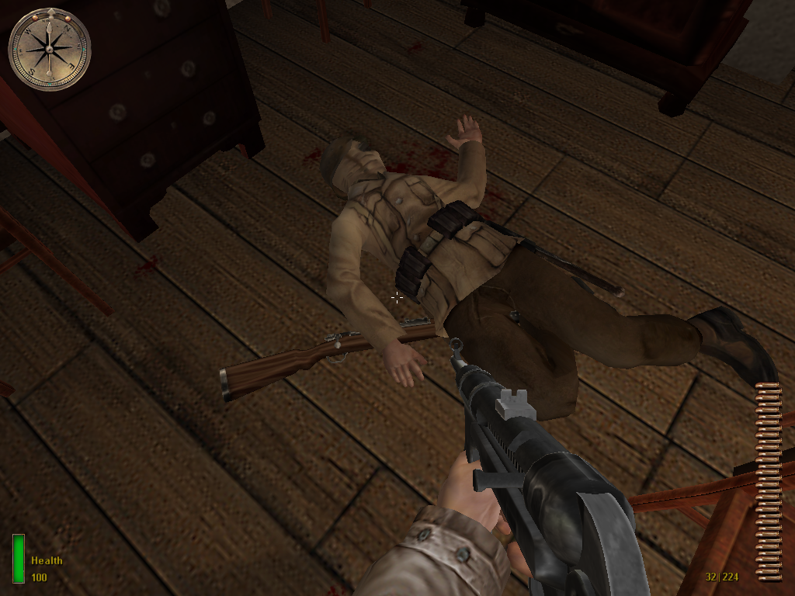
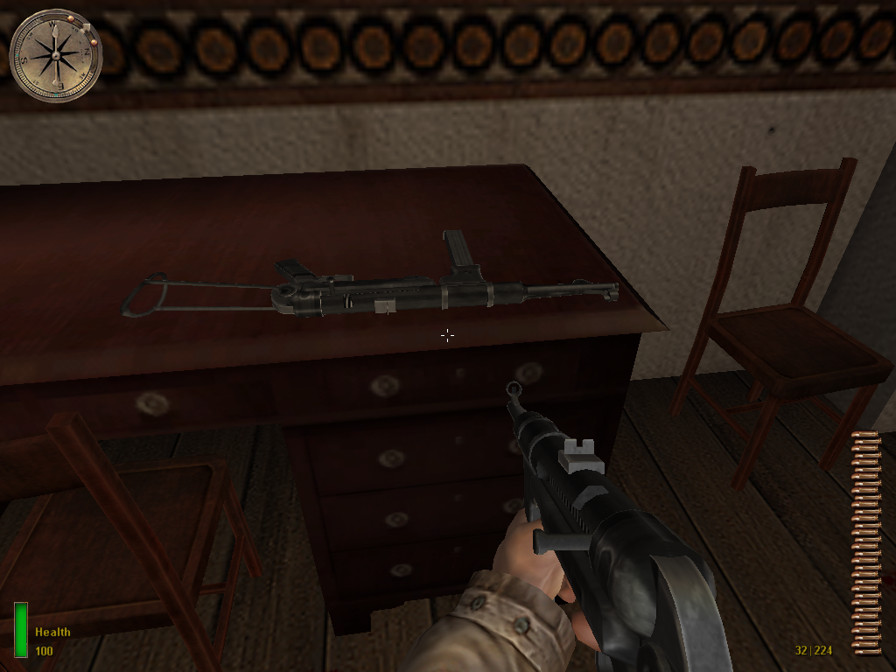

# Iron Sights 

### :warning: Using this mod and removing it from the directory later will cause all your savefile to not work. Use at your own risk. 

A simple and straightforward mod for [Medal of Honor: Allied Assault](https://en.wikipedia.org/wiki/Medal_of_Honor:_Allied_Assault) adding iron sights as well as new gun textures and secondard attack for all weapons except stationary turrets and rocket launchers (bazooka and panzerschreck).  

## Installation 

Copy and paste `user-locknload.pk3` and `zuser-ironsights.pk3` into the 'main' directory of your game's installation directory. **Resist from also pasting this README file and src folder into the installation folder to prevent any unwanted bugs.**

## Known Issues 

1. The aiming animation for STG44 doesn't work as intended. Even though it is an endgame weapon, its clunky feel will be temporary. So **just ignore that bug**.
2. Weapon aims akwardly while crouching and aiming. 
3. Weapon name doesn't appear in the place it is supposed to be. But who cares? If you played the game for a long time, you will already know every weapon's name.
4. Aim crouching model of the gun is weird. 

## Screenshots

